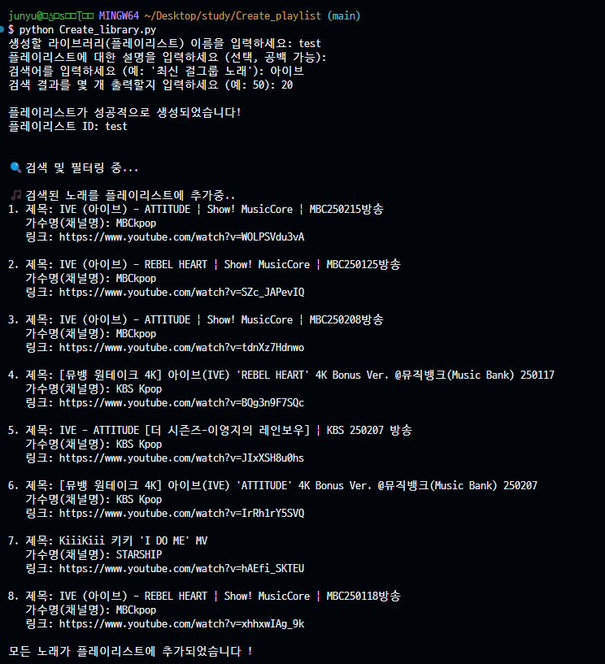
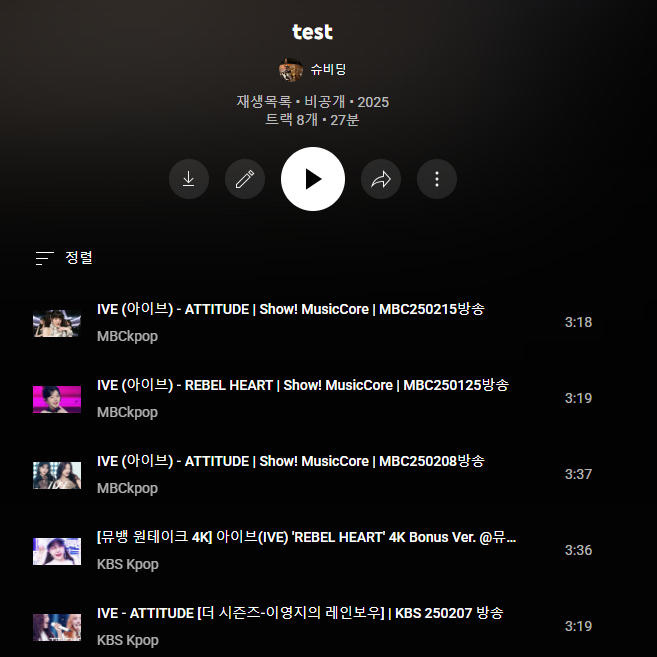

# Create Playlist Library

이 문서는 Create Playlist Library 프로젝트의 준비 단계부터 최종 단계까지의 과정을 정리한 문서입니다. 이 README.md 파일은 프로젝트를 진행하면서 수행한 모든 주요 작업과 결정 과정을 한눈에 볼 수 있도록 구성되었습니다.

## 목차

- [사전준비](#사전준비)
- [파일 설명](#파일-설명)
- [사용법](#사용법)
- [결과](#결과)

## 사전준비
### YouTube Data API v3 사용 방법 및 client_secret.json 받기

1. **Google Cloud Platform에 로그인 및 프로젝트 생성**
   - [Google Cloud Console](https://console.developers.google.com/)에 접속하여 Google 계정으로 로그인합니다.
   - 상단의 "프로젝트 선택" 버튼을 클릭하고, "새 프로젝트"를 선택합니다.
   - 프로젝트 이름 및 기타 필요한 설정(예: 조직, 위치 등)을 입력하고 프로젝트를 생성합니다.

2. **YouTube Data API v3 활성화**
   - 생성한 프로젝트가 선택된 상태에서, 왼쪽 메뉴의 "API 및 서비스" > "라이브러리"로 이동합니다.
   - 검색창에 "YouTube Data API v3"를 입력한 후, 검색 결과에서 해당 API를 선택합니다.
   - "사용" 버튼을 클릭하여 API를 활성화합니다.

3. **OAuth 동의 화면 구성**
   - 왼쪽 메뉴에서 "API 및 서비스" > "OAuth 동의 화면"으로 이동합니다.
   - 사용자 유형(외부 또는 내부)을 선택합니다.
   - 애플리케이션 이름, 지원 이메일, 그리고 필요 시 개발자 연락처 정보를 입력합니다.
   - 필수 항목들을 모두 채운 후 "저장" 버튼을 클릭합니다.

4. **자격 증명 생성 및 client_secret.json 다운로드**
   - 왼쪽 메뉴에서 "API 및 서비스" > "자격 증명"으로 이동합니다.
   - "자격 증명 만들기" 버튼을 클릭한 후, "OAuth 클라이언트 ID"를 선택합니다.
   - 애플리케이션 유형(예: 데스크톱 앱, 웹 애플리케이션 등)을 선택하고, 필요한 정보를 입력합니다.
   - "생성" 버튼을 클릭하면 OAuth 클라이언트 ID가 생성됩니다.
   - 생성된 자격 증명을 클릭하여 상세 정보 페이지로 이동한 후, "다운로드" 버튼을 클릭하면 **client_secret.json** 파일을 다운로드할 수 있습니다.
   - 이 파일은 API 인증에 사용되므로, 프로젝트 내 안전한 위치에 보관합니다.

5. **클라이언트 라이브러리와 통합**
   - 다운로드한 client_secret.json 파일을 프로젝트의 루트 디렉토리 또는 적절한 위치에 복사합니다.
   - 사용 언어에 맞는 Google API 클라이언트 라이브러리를 설치합니다.
     - 예를 들어, Python의 경우:
       ```bash
       pip install google-auth google-auth-oauthlib google-api-python-client
       ```
   - 라이브러리를 통해 OAuth 인증 프로세스를 구현하고, client_secret.json 파일을 사용하여 인증 토큰을 생성한 후 API 호출에 활용합니다.

이 과정을 통해 YouTube Data API v3를 활용할 수 있으며, client_secret.json 파일은 API 호출 시 필수 인증 자료로 사용됩니다.

## 파일 설명
- client_secret.json

    : API 호출을 위한 파일로, 개인 youtube계정에 접속 가능하도록 도움

- token.pickle

    : OAuth인증 및 Youtube API 초기화 역할

    사용자가 처음 인증을 완료하면, 그 인증 정보가 token.pickle 파일에 저장되므로 다음 번에 애플리케이션을 실행할 때마다 새로 로그인 과정을 거치지 않고 이 파일을 불러와서 API 호출을 진행

    매번 인증 과정을 반복하지 않도록 하여 사용자 경험을 개선하고, 인증 속도를 높여주는 중요한 역할

- install.sh

    : Create_library.py 파일을 실행하기 위해 필요한 library를 install하도록 함

- Create_library.py

    : 해당 프로젝트의 main파일로, 새로운 playlist library를 생성하고, 조건에 맞는 음악을 찾음으로써 생성한 library에 저장하도록 하는 작업을 수행함

## 사용법

- install library
```bash
user@:~$ bash install.sh
```

- Run Create_library.py
```bash
user@:~$ python Create_library
```

## 결과


